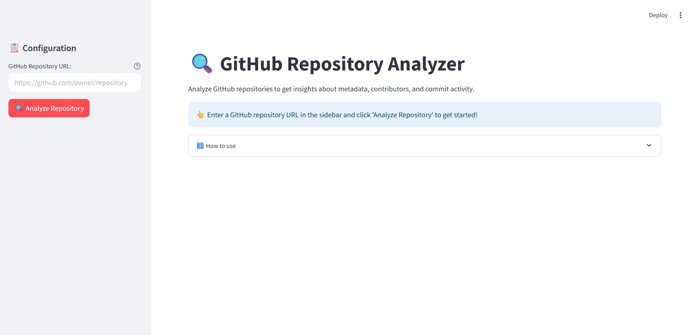
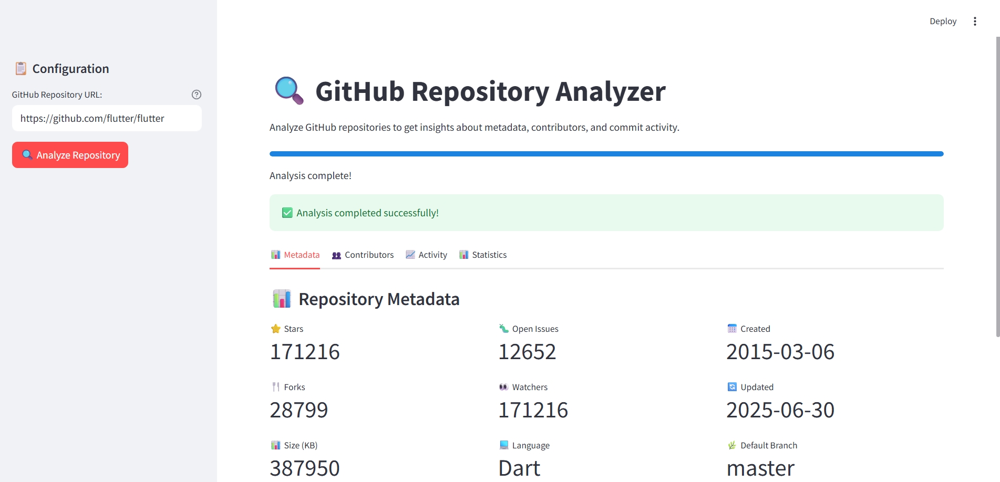
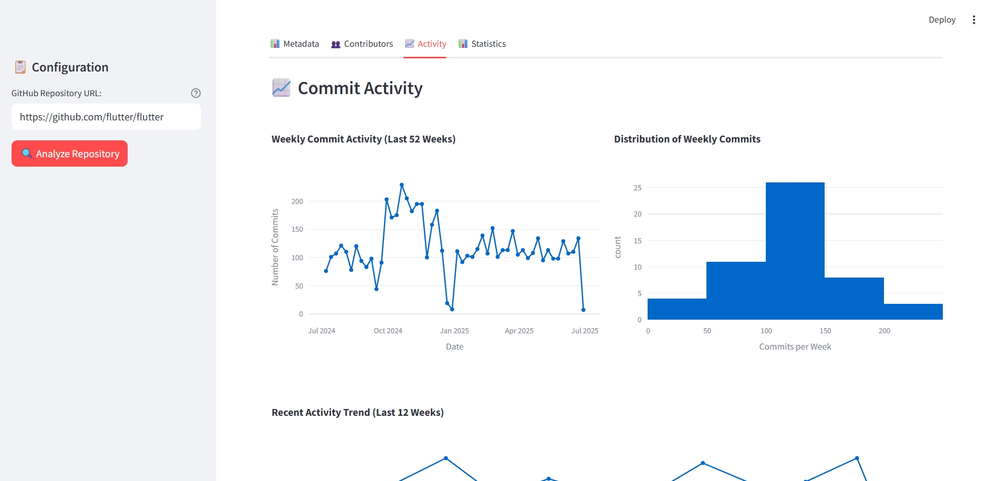
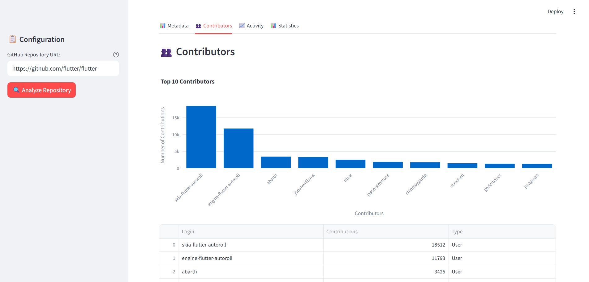
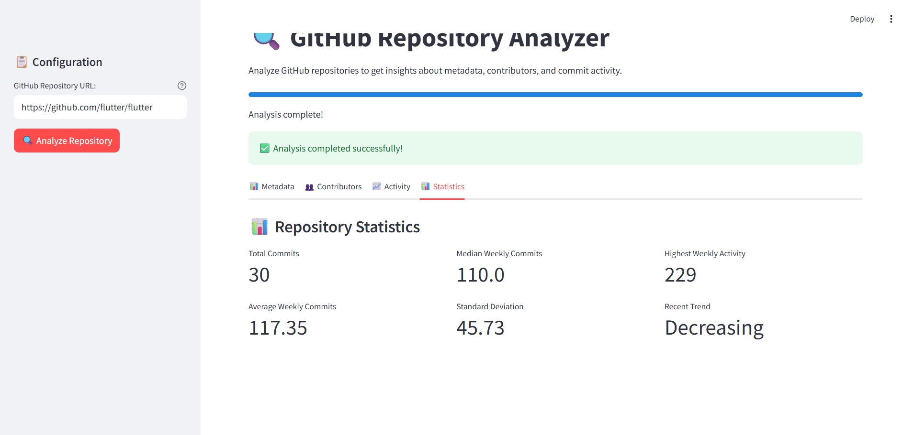

# GitHub Repository Analyzer

A Streamlit-based web application that analyzes GitHub repositories and provides detailed insights about repository metrics, activity trends, and more.

## Features

- Repository Metadata Display
- Activity Trend Analysis
- Visualization of Repository Statistics
- Interactive Charts and Graphs
- Easy-to-use Interface

## Tech Stack

- Streamlit
- Python
- GitHub API
- Plotly for data visualization
- Pandas for data manipulation
- Matplotlib for additional plotting capabilities

## Installation

1. Clone the repository:
```bash
git clone https://github.com/Tanishraj07/Git-hub-analyzer.git
cd Git-hub-analyzer
```

2. Install dependencies:
```bash
pip install -r requirements.txt
```

3. Run the application:
```bash
streamlit run test.py
```

## Usage

1. Enter a GitHub repository URL in the input field
2. Click "Analyze Repository"
3. View detailed analysis including:
   - Repository metadata
   - Activity trends
   - Statistics visualization
   - Interactive charts

## Screenshots







## Project Structure

- `main.py`: Main application file containing Streamlit interface and analysis logic
- `requirements.txt`: List of required Python packages
- `.gitignore`: Git ignore file for excluding unnecessary files

## Contributing

1. Fork the repository
2. Create your feature branch (`git checkout -b feature/AmazingFeature`)
3. Commit your changes (`git commit -m 'Add some AmazingFeature'`)
4. Push to the branch (`git push origin feature/AmazingFeature`)
5. Open a Pull Request

## License

This project is licensed under the MIT License - see the LICENSE file for details.
